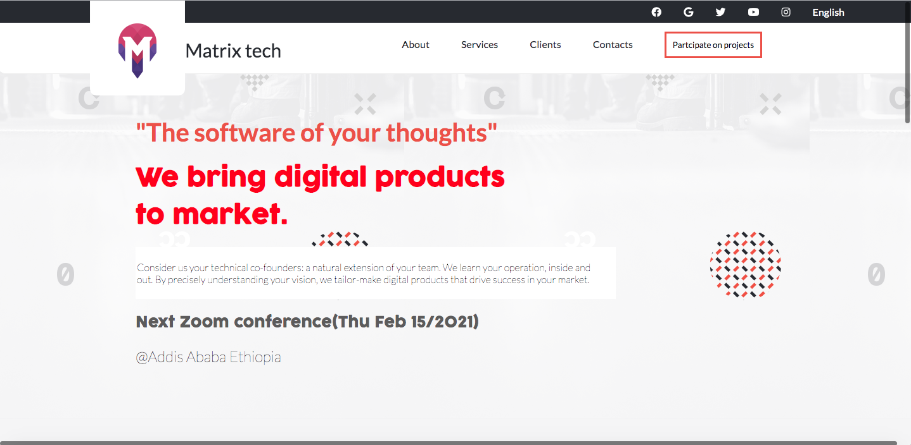

# Module 1 capstone project

> **Welcome to my HTML/CSS and JavaScript basics capstone project on github !!!**
> It is Matrix software company webiste

  
Please click to view more sections

## Built With

- HTML
- CSS
- Javascript

## Live Demo

[Live Link](https://dagic-zewdu.github.io/Capstone-project-1/)

## Authors

👤 **Dagic zewdu**

- GitHub: [@Dagic](https://github.com/Sboursen)
- Twitter: [@Dagic](https://twitter.com/sboursen_dev)
- LinkedIn: [LinkedIn](https://linkedin.com/in/sboursen)

## Contributors

> Many thanks to these amazing people who helped me
> complete this project 🙏🙏🙏

👤 **A**

- GitHub: [@A](https://github.com/Dagic-zewdu)
- Twitter: [@A](https://twitter.com/dagic4)
- LinkedIn: [A](https://www.linkedin.com/in/dagi-zewdu-21b835215/)

👤 **A**

- GitHub: [@A](https://github.com/A)
- Twitter: [@A](https://twitter.com/A)
- LinkedIn: [A](https://linkedin.com/in/A)

## Show your support

Give a ⭐️ if you like my project!

## 📝 License

This project is [MIT](./MIT.md) licensed.

## Acknowledgements

Original design idea by [Cindy Shin in Behance](https://www.behance.net/adagio07)
